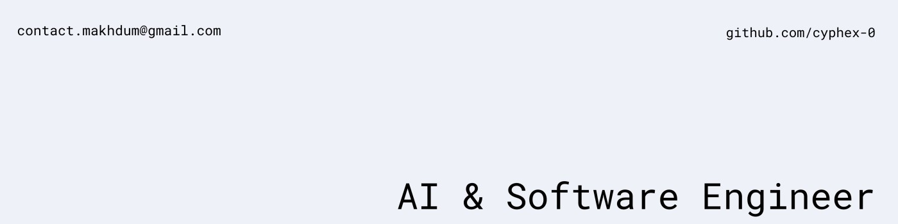

<!-- ============================================== -->
<!-- 🚀 GITHUB PROFILE README — Shah Makhdum Jim    -->
<!-- AI & Software Engineer | cyphex-0              -->
<!-- ============================================== -->

<!-- ═══════════════════ BANNER ═══════════════════ -->

  

<!-- ═══════════════ PROFILE VIEWS ═══════════════ -->

  
  

<!-- ═══════════ TYPING ANIMATION ═══════════════ -->

  

<!-- ═══════════════ WAVE DIVIDER ═══════════════ -->

<!-- ═══════════════ ABOUT ME ═══════════════════ -->

##  About Me

I'm **Shah Makhdum Jim** — a passionate **AI & Software Engineer** from **Khulna, Bangladesh** 🇧🇩

I enjoy building applications that are not only functional but also intelligent. I thrive at the intersection of **artificial intelligence** and **modern software engineering**, crafting solutions that push the boundaries of what's possible.

 

- 🔭 **Currently building:** A **Terminal-Native AI Coding Agent** — an autonomous coding assistant that operates directly within your local command-line interface.

- 🧠 **Multi-Agent Architecture:** Designing a **Multi-Agent Swarm** system that uses a team of specialized AI workers and a Python coprocessor for deep, efficient codebase understanding.

- ⚡ **Self-Healing Execution:** Building systems that autonomously plan tasks, run code in secure sandboxes, fix their own errors, and safely manage Git rollbacks.

- 🌱 **Currently learning:** Advanced **Backend Development** & cutting-edge **AI** techniques.

- 💬 **Ask me about:** Machine Learning, Backend Development, Databases, System Design

- 📫 **Reach me at:** **contact.makhdum@gmail.com**

- 🐞 **Fun fact:** The term "bug" became popular after a real moth was found stuck inside the Harvard Mark II computer in 1947. Engineers taped the moth into the logbook and labeled it the *"first actual case of bug being found."*

 

<!-- ═══════════════ WAVE DIVIDER ═══════════════ -->

<!-- ═══════════════ CONNECT ═══════════════════ -->

##  Connect With Me

  &nbsp;
  &nbsp;
  &nbsp;
  

<!-- ═══════════════ WAVE DIVIDER ═══════════════ -->

<!-- ═══════════════ TECH STACK ═══════════════ -->

##  Tech Stack & Skills

<!-- ─── Programming Languages ─── -->
<h3 align="center">🔤 Programming Languages</h3>

  &nbsp;
  &nbsp;
  &nbsp;
  &nbsp;
  &nbsp;
  

<!-- ─── AI & Machine Learning ─── -->
<h3 align="center">🤖 AI & Machine Learning</h3>

  &nbsp;
  &nbsp;
  &nbsp;
  

<!-- ─── Frontend Development ─── -->
<h3 align="center">🎨 Frontend Development</h3>

  &nbsp;
  &nbsp;
  &nbsp;
  &nbsp;
  &nbsp;
  

<!-- ─── Backend Development ─── -->
<h3 align="center">⚙️ Backend Development</h3>

  &nbsp;
  &nbsp;
  

<!-- ─── Databases ─── -->
<h3 align="center">🗄️ Databases</h3>

  &nbsp;
  &nbsp;
  

<!-- ─── Cloud, DevOps & Tools ─── -->
<h3 align="center">☁️ Cloud, DevOps & Tools</h3>

  &nbsp;
  &nbsp;
  &nbsp;
  &nbsp;
  &nbsp;
  &nbsp;
  &nbsp;
  &nbsp;
  

<!-- ─── Design Tools ─── -->
<h3 align="center">🖌️ Design Tools</h3>

  &nbsp;
  &nbsp;
  

<!-- ═══════════════ WAVE DIVIDER ═══════════════ -->

<!-- ═══════════════ GITHUB STATS ═══════════════ -->

##  GitHub Analytics

<!-- ─── Stats + Languages Side by Side ─── -->

  &nbsp;&nbsp;
  

<!-- ─── GitHub Streak ─── -->

  

<!-- ─── GitHub Trophies ─── -->

  

<!-- ─── Activity Graph ─── -->

  

<!-- ═══════════════ WAVE DIVIDER ═══════════════ -->

<!-- ═══════════════ SNAKE ANIMATION ═══════════════ -->

## 🐍 Contribution Snake

  <picture>
    <source media="(prefers-color-scheme: dark)" srcset="https://raw.githubusercontent.com/cyphex-0/cyphex-0/output/github-snake-dark.svg" />
    <source media="(prefers-color-scheme: light)" srcset="https://raw.githubusercontent.com/cyphex-0/cyphex-0/output/github-snake.svg" />
    
  </picture>

<!-- ═══════════════ FOOTER ═══════════════════ -->

  

